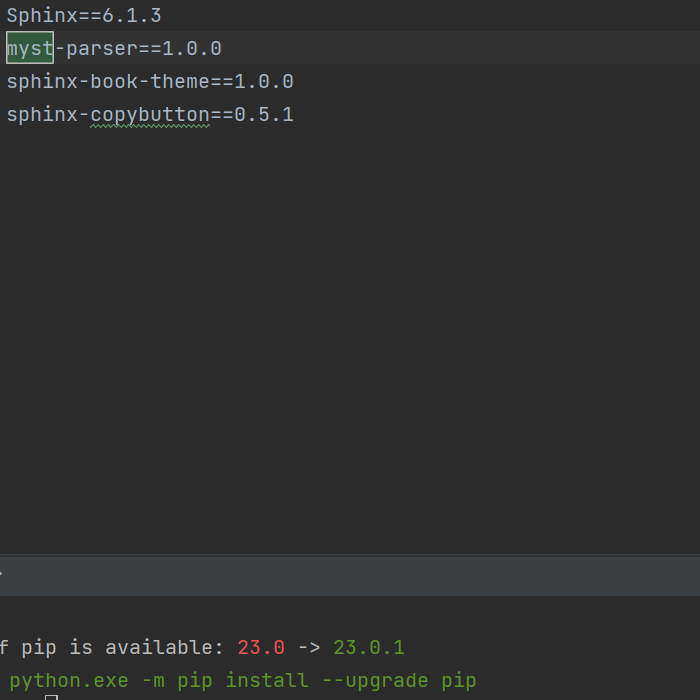

# Test

## Example

:::{figure-md}
{width=200px}

This is a caption in __*Markdown*__
:::

```{image} ./_static/Snipaste_2023-04-13_18-44-55.png
:alt: fishy
:class: bg-primary
:width: 700px
:align: center
```


```{image} ./_static/Snipaste_2023-04-13_18-44-55.png
:alt: fishy
:class: bg-primary
:width: 500px
:align: center
```

```{image} ./_static/Snipaste_2023-04-13_18-44-55.png
:alt: fishy
:class: bg-primary
:width: 400px
:align: center
```

```{image} ./_static/Snipaste_2023-04-13_18-44-55.png
:alt: fishy
:class: bg-transparent
:width: 400px
:align: center
```

```{figure} ./_static/Snipaste_2023-04-13_18-44-55.png
:figwidth: 450px
:figclass: bg-transparent
```

## Motivation

:::{list-table}

-  - [Custom tip](https://example.com)

-  - [Wikipedia tips](https://en.wikipedia.org/wiki/Tooltip)

-  - [DOI tip](https://doi.org/10.1186/gm483)

-  - [ReadTheDocs tip](https://www.sphinx-doc.org/en/master/usage/quickstart.html#intersphinx)

-  - {ref}`Figure reference with URL image <./_static/Snipaste_2023-04-13_18-44-55.png>`

:::


[图](./_static/Snipaste_2023-04-13_18-44-55.png)

[图](http://gatherer.wizards.com/Handlers/Image.ashx?multiverseid=457000&type=card)

{ref}`Figure reference with URL image <./_static/Snipaste_2023-04-13_18-44-55.png>`

## Acknowledgement

```
Yes = 233333
Yes = 233333
```

```none
Yes = 233333
Yes = 233333
H1H2
```


```python
def f(x):
    return True
```

```{toctree}
:hidden:

yamaguchi/index.md
```
